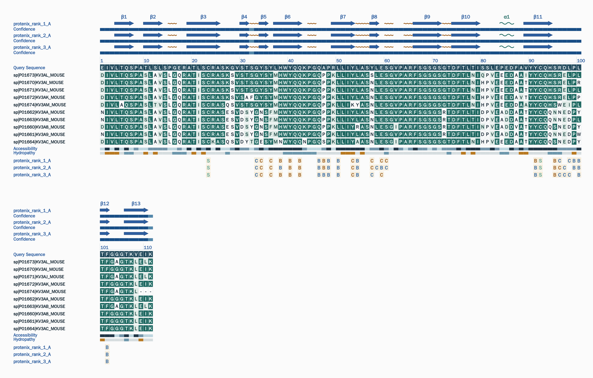

> **Note:** Please do not look at the "page" branch.
# OpenFoldPanel

`OpenFoldPanel` generates a shareable comparison report for one or more protein structure models centered on a reference chain. It combines secondary structure, accessibility, hydropathy, contacts, confidence, optional MSA / conservation, antibody numbering, and optional TM-score clustering into one local batch workflow.

The project is designed for offline and reproducible use. Instead of relying on a hosted service, it writes HTML, PDF, JSON, CSV, summary, and log artifacts that can be archived or passed to downstream analysis scripts.

| Output | Purpose |
| --- | --- |
| `report.html` | Interactive browser report |
| `reference-chain-<CHAIN>.pdf` | Chain-level export for sharing and annotation |
| `tracks.json` | Machine-readable report payload |
| `csv/*.csv` | Job-level statistics tables |
| `summary.txt` | Short human-readable job summary |
| `logs.txt` | Detailed execution log |


## Quick Start

### 1. Create an isolated environment

Using an isolated `conda` / `mamba` environment is strongly recommended.

```bash
mamba create -n openfoldpanel -c conda-forge -c bioconda \
  python=3.10 pip \
  cmake ninja cxx-compiler pkg-config git

conda activate openfoldpanel
```

### 2. Install the project

```bash
python -m pip install -r requirements.txt
python -m pip install -e .
```

Recommended practice:

- Use the environment Python consistently, for example `python -m openfoldpanel`.
- Avoid `pip install --user ...` for this project, because `~/.local/lib/python*/site-packages` can override packages from the active environment.
- If you suspect user-site package interference, run with `PYTHONNOUSERSITE=1`.

### 3. Run the minimal pipeline

```bash
python -m openfoldpanel \
  --input ./model.pdb \
  --outdir ./out
```

### 4. Open the results

Each job writes a dedicated subdirectory under `--outdir`, containing at least:

- `report.html`
- `tracks.json`
- `csv/`
- `summary.txt`
- `logs.txt`

## Main Entry Points

### Preferred entry point: raw CLI

The raw CLI exposes the full parameter set:

```bash
python -m openfoldpanel --input ./models.zip --outdir ./out
```

This is the recommended interface for routine use, debugging, and scripting.

### Convenience wrapper: `run.py`

`run.py` is a wrapper that:

- writes temporary outputs under `./tmp`
- copies generated HTML to the current working directory
- packages HTML / PDF outputs into `OpenFoldPanel_results.tar.gz`

Example:

```bash
python run.py \
  --input ./data/protenix_123.zip \
  --msa-db PDBAA \
  --max-homologs-displayed 10
```

Use `run.py` when you want a fixed wrapper workflow. Use `python -m openfoldpanel` when you need the full CLI surface.

## Installation and Dependency Model

### Core Python dependencies

The Python packages listed in `requirements.txt` are required for the base reporting flow.

### Optional external tools

The program can run without some external tools, but feature completeness depends on them.

| Tool | Used for | Behavior when missing |
| --- | --- | --- |
| `mkdssp` / `dssp` | Secondary structure and accessibility | Falls back to geometry-based estimation |
| `blastp` or `mmseqs` | Homolog search | MSA search is skipped |
| `clustalo` | Multiple sequence alignment | Conservation stage is limited or skipped |
| `hmmscan` | Antibody numbering via current ANARCI path | Antibody numbering track is skipped |
| `USalign` / `US-align` | TM-score matrix and clustering | TM-score outputs are skipped and the job may become `partial_success` |

### Install common enhancement tools

```bash
mamba install -n openfoldpanel -c conda-forge -c bioconda \
  blast mmseqs2 clustalo hmmer
```

### Install DSSP

Quick installation:

```bash
mamba install -n openfoldpanel -c sbl dssp
```

If you want to install DSSP  under the project directory, Preparing the DSSP source tree from the project root:
```
mkdir -p ./vendor
git clone https://github.com/PDB-REDO/dssp.git ./vendor/dssp
cd ./vendor/dssp
```

Then build and install DSSP into ./.local/dssp:
```
cmake -S . -B build -G Ninja \
  -DCMAKE_BUILD_TYPE=Release \
  -DCMAKE_INSTALL_PREFIX="$(cd ../.. && pwd)/.local/dssp"

cmake --build build -j"$(nproc)"
cmake --install build
```

add it to `PATH`:

```bash
export PATH="$(pwd)/.local/dssp/bin:$PATH"
```

### Install US-align

For TM-score clustering:

```bash
conda install -c bioconda usalign
```

Or build it locally under `./.local/bin/USalign` and then add that directory to `PATH`.

### Verify the current shell

```bash
which mkdssp || which dssp
blastp -version
mmseqs version
clustalo --version
hmmscan -h
USalign -h || US-align -h
```

For database download and build workflows, see [`blastdb/README.md`](./blastdb/README.md).

## Common Run Patterns

### Single structure file

```bash
python -m openfoldpanel \
  --input ./model.pdb \
  --outdir ./out
```

### Multiple structure files inside one archive root -> one job

```bash
python -m openfoldpanel \
  --input ./models.tar.gz \
  --outdir ./out
```

### Multiple first-level subdirectories inside one archive -> multiple jobs

```bash
python -m openfoldpanel \
  --input ./batch_jobs.zip \
  --outdir ./out
```

### Run with MSA

```bash
python -m openfoldpanel \
  --input ./models.zip \
  --outdir ./out \
  --msa-db ./blastdb/pdbaa/pdbaa \
  --max-homologs-displayed 5 \
  --evalue 1e-6
```

### Disable MSA explicitly

```bash
python -m openfoldpanel \
  --input ./models.zip \
  --outdir ./out \
  --disable-msa
```

### Disable TM-score clustering explicitly

```bash
python -m openfoldpanel \
  --input ./models.zip \
  --outdir ./out \
  --disable-tm-clustering
```

This is useful when you do not want missing `USalign` to affect the job status.

## Inputs

### Supported input types

- Structure files: `.pdb`, `.cif`, `.mmcif`
- Archives: `.zip`, `.tar`, `.tar.gz`, `.tgz`, `.tar.bz2`, `.tbz2`, `.tar.xz`, `.txz`

### Job discovery rules

- A single structure file is treated as one job.
- If an archive root contains multiple first-level subdirectories, each first-level subdirectory becomes a separate job.
- If an archive root directly contains multiple structure files, the archive is treated as one job.
- Structure files inside a job are processed in natural sort order.
- Non-structure files are ignored and recorded in logs when relevant.

### Recommended input conditions

- Comparing models is easiest when they contain compatible chain composition and similar chain sequences.
- The first successfully parsed model becomes the reference for chain collection and sequence axis construction.
- Monomers, homo-oligomers, and hetero-oligomers are supported.
- Modified residues, ligands, ions, and nucleic acids can be present.
- For report readability, keeping one comparison batch at `25` models or fewer is recommended.

## Outputs

### Per-job outputs

Typical job artifacts are:

- `report.html`
- `reference-chain-<CHAIN>.pdf`
- `tracks.json`
- `csv/contact-consensus.csv`
- `csv/tm-score-matrix.csv` when TM-score clustering is available
- `csv/tm-clusters.csv` when TM-score clustering is available
- `csv/antibody-summary.csv` when antibody numbering is available
- `summary.txt`
- `logs.txt`


### Job status

The final job status is one of:

- `success`
- `partial_success`
- `failed`

Typical reasons for `partial_success`:

- PDF export was skipped because PDF conversion dependencies were unavailable
- TM-score clustering was skipped because `USalign` / `US-align` was unavailable
- some models or reference chains could not be mapped and were skipped

Warnings and reasons are always written to `summary.txt` and `logs.txt`.

## Key CLI Parameters

| Parameter | Default | Description |
| --- | --- | --- |
| `--input PATH` | None | Input structure file or archive |
| `--outdir PATH` | None | Output directory |
| `--chain ALL\|CHAIN_ID` | `ALL` | Render all protein chains or only one selected chain |
| `--columns INT` | `80` | Residue columns per render block |
| `--font-size INT` | `12` | Base report font size |
| `--hyd-window INT` | `3` | Hydropathy smoothing window |
| `--msa-db PATH` | None | Local BLAST / MMseqs database prefix or protein FASTA |
| `--max-homologs-displayed INT` | `5` | Number of homolog rows to retrieve and render |
| `--evalue VALUE` | `1e-6` | BLAST / MMseqs significance threshold |
| `--disable-msa` | Off | Skip homolog search and conservation stage |
| `--keep-temp` | Off | Keep temporary extraction and alignment files |
| `--contact-cutoff FLOAT` | `3.7` | Weak-contact cutoff in angstrom |
| `--strong-contact-cutoff FLOAT` | `3.2` | Strong-contact cutoff in angstrom |
| `--tm-cluster-cutoff FLOAT` | `0.7` | Average-linkage TM-score clustering cutoff |
| `--disable-tm-clustering` | Off | Skip TM-score matrix and cluster assignment |
| `--verbose` | Off | Enable verbose logging |

Notes:

- `--chain ALL` is the default. The program renders each protein chain from the first successfully parsed structure.
- `--max-homologs-displayed 0` keeps only the query row and skips homolog display.
- `--msa-db` accepts either a ready BLAST prefix or a FASTA file. See [`blastdb/README.md`](./blastdb/README.md).

## Example



Open the full [OpenFoldPanel example](https://karenlhao.github.io/OpenFoldPanel/).

## Acknowledgements and Reference

`OpenFoldPanel` takes strong inspiration from FoldScript at the product-design level.

- Robert, X., Guillon, C., Gouet, P. (2025). *FoldScript: a web server for the efficient analysis of AI-generated 3D protein models*. *Nucleic Acids Research*, 53(W1), W277-W282. DOI: [10.1093/nar/gkaf326](https://doi.org/10.1093/nar/gkaf326)
